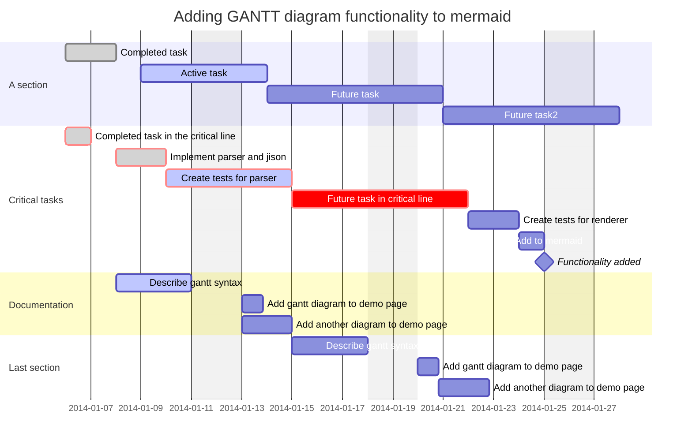

# Esse é um título do Kderno

Aqui vai um texto para a gente começar.

| ID  | Cliente         | Idade | Sexo |
| --- | --------------- | ----- | ---- |
| 1   | Lucas           | 35    | M    |
| 2   | João das Couves | 32    | M    |

Aqui<mark> vai mais</mark> um texto **em negrito**.

>  Depois adiciono mais alguma coisa

```kderno
{"block": 1, "plugin": "subscriptionblock"}
```

```kderno
{"block": 2, "plugin": "quickessayblock"}
```

```kderno
{"block": 3, "plugin": "embednotebookblock"}
```

Aqui vai um [link para um kderno](/@lucas/meu-kderno-curso-1) que vou mostrar depois.


## Subtítulo


### Sub sub título

# Gestão de projeto


